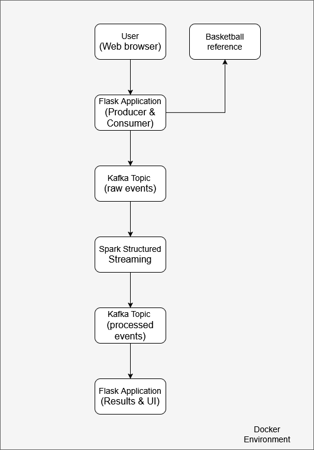

# NBA Salary Prediction with Spark Streaming

## Project Overview
This project predicts NBA player salaries based on on-court performance statistics using machine learning and a real-time data pipeline. It focuses on large-scale data processing, streaming, and model comparison using **Apache Spark** and **Kafka**.

Users can input statistics for a hypothetical player and receive:

- A predicted salary

- The application also identifies real NBA players whose salaries are closest to the predicted value and links them to their Basketball Reference profiles.

The project emphasizes real-time data streaming and distributed processing, with machine learning serving as an applied use case.

## Features Used

The prediction is based on the following player attributes:

- Age
- Points per game (PPG)
- Field goal percentage
- Three-point percentage
- Free throw percentage
- Assists per game (APG)
- Rebounds per game (RPG)
- Steals per game (SPG)
- Blocks per game (BPG)
- Minutes per game (MPG)

## Models

Three regression models were implemented and compared:

- **Huber Regression**
- **Ridge Regression**
- **Random Forest Regressor**

The final salary prediction is computed as a **simple ensemble average** of all three models.

Prediction uncertainty is estimated using the **standard deviation** across model outputs.

| Model         | RMSE  | MAE   | R²    | MSE   |
| ------------- | ----- | ----- | ----- | ----- |
| Huber         | 0.540 | 0.428 | 0.721 | 0.292 |
| Ridge         | 0.541 | 0.430 | 0.720 | 0.293 |
| Random Forest | 0.505 | 0.398 | 0.756 | 0.255 |

### Model Comparison

The results show that the nonlinear Random Forest model outperforms linear models, suggesting that the relationship between player statistics and salary is not purely linear.
At the same time, Ridge and Huber regression capture a large portion of the variance, indicating a mix of linear and nonlinear structure in the data.

Because the models differ in inductive bias:

- Ridge and Huber provide smooth, low-variance linear estimates

- Random Forest captures nonlinear interactions but can exhibit higher variance in sparse regions

Their errors tend to occur in different parts of the feature space. For this reason, the final prediction is computed as an ensemble average of all three models.

Ensembling:

- Reduces both bias and variance

- Stabilizes predictions compared to Random Forest alone

- Improves robustness in edge cases

- Enables a natural uncertainty estimate via the standard deviation of model outputs

## Data Sources

- Player salaries: [Kaggle NBA Players Salaries dataset](https://www.kaggle.com/datasets/omarsobhy14/nba-players-salaries)

- Player statistics: Basketball Reference, collected via ``basketball_reference_web_scraper``

## Components

- Flask application (frontend + backend logic)

- Apache Kafka for event streaming

- Apache Spark (Structured Streaming & PySpark ML) for data processing and modeling

- Docker for containerization - All services (Kafka, Spark, and the Flask application) are containerized using Docker.

## Streaming Architecture

The application follows a real-time streaming pipeline:

App (Producer) → Kafka → Spark Structured Streaming → Kafka → App (Consumer)

Player statistics are sent as JSON events, processed in Spark, and streamed back to the application with salary predictions and similar-player results.

## Technology

- ``Python``
- ``Apache Spark``
- ``Apache Kafka``
- ``PySpark ML``
- ``Flask``
- ``Docker``